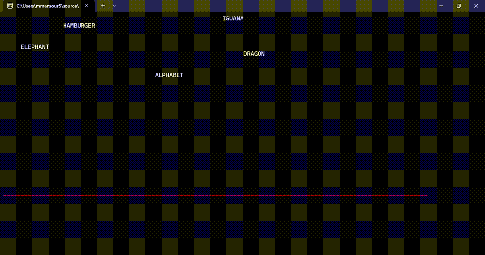
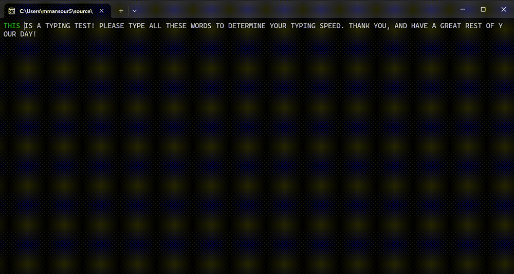

# Typing-Tutor-Assembly-CS066-Final-Project

# Demonstration:
(Full MP4 Located in Videos Folder)    
The Typing Tutor Game  

    
The Typing Test   

# Procedures:

- dropWord  
Drop word uses the esi, eax, ebx, and edx registers to hold the offsets of string to be dropped as well as the horizontal and vertical positions (these are simply pointers). These registers are filled with appropriate values before the function call, and the function will first incrememt the vertical position in memory. It will first check if the value is greater than zero (if it is, then we will continue with the function, otherwise we will jump to the end of the function and do nothing). Then, it will dereference the pointers to vertical/horizontal positions and go to the correct position on the screen using the gotoxy macro, then it will print to the screen using the writeString macro if the position is > 0. Afterwards, it will check if the pointer to the existing buffer matches the pointer to the word we are currently on, and then write over the current word with the current buffer (in green) if it is. Finally, it will check to see if the game has concluded (that is, if the vertical position of the word has reached the boundary line 25). If the game has concluded, the carry flag is set. If the game is still in progress, the carry flag is cleared.
- createBoundaryLine  
Creates a boundary line of x's to indicate the level where words cannot reach (or elset the carry flag is triggered and the game ends). It is written in red and (0, 25). This procedure uses the offset of a memory instance called boundary line, and it modifies the eax and edx registers.
- writeBufferToScreen  
Writes the current buffer to the screen in green at (0, 0). It uses a memory instance called buffer, and it modifies the eax and edx registers. 
- appendToBuffer  
Prior to this function call, the readKey proc must be called and al must hold the value of the most recently read in character. It uses the offset of the buffer variable, and it also uses the buffersize from memory. It appends the read in key to the buffer using the offset of the buffer as a pointer and adds the size of the current buffer (aka buffer[buffersize] = read in character). It modifies the eax, ebx, adn dl registers.
- clearBuffer  
Wipes all memory associated with the buffer variable including: buffer, buffersize, arrayPositionPointer, nextExpectedPositionPointer, bufferHorizontalPositionPointer, and bufferVerticalPositionPointer. It sets all these to 0/Null. This function is used when the user completes the word/text and wants to reset the buffer entirely. 
- incrementPositions  
Used for traversing the dictionary and iterating through all the words in our list. It simply increments the two pointers associated with horizontal and vertical positions from memory. It also will jump to the next word in the list using indexed addressing (ecx holds the iteration of where we are in the loop, so length of wordSizes array - ecx = index of where we are in the array). This is loaded into ebx and added to displayedWord (the pointer to where we are currently in the dictionary). This essentially boils down to (displayedWord += wordSizes[lengthof wordSizes - ecx]) to add the correct distance to the next word. The ebx register is overriden, and ecx must hold a logical value before this function call.
- inputLadder  
The layout of the if-else statement for reading in and evaluating input from the user is as follows:  
>read in a key and store it into the al register using readKey  
>if(a key is read in)  
>> if(arrayPositionPointer is 0, which means the pointer is nullptr)  
>>> 1. we are not locked into a target, so immediately append it to the buffer  
>>> 2. linearly loop through the dictionary array until the first character matches the one that was just read into al  
>>> 3. set all buffer variables accordingly, which keeps the program locked onto the word until the user completely types it in correctly  
>>> 4. go to the position on the screen where the buffer is, and write over the existing text in green  

>> else (we are already locked onto a target and are expecting a specific character)  
>>> if(the read-in key holds the value at nextExpectedPosition, aka the user correctly types in the subsequent character)  
>>>> 1. append it to the buffer using the append to buffer procedure, and adjust all variables accordingly  
>>>> 2. go to the position on the screen where the buffer is, and write over the existing text in green  

>>> else (the read-in key was not correct/expected
>>>> 1. do not append it to the buffer since it was not correct  
>>>> 2. go to the position on the screen where the buffer is, and write over the existing text in green  

> else (no key was read-in, so do nothing)  
Finally, reset the text color to white since we changed it to green earlier
- calculateWordsPerMin  
Uses the DIV operator to calculate the typing speed in words per minute. Given a set delay, dividing 100000 by the number of iterations of the game loop (100000 / numIterations) will result in the typing speed of the user in words per minute.
- playTypingTutorFalling  
The main game loop for typing tutor game. It first clears the screen and moves all corresponding values into registers. ecx will hold the size of the array to be used as a loop counter, and the offsets of dictionary and horiztonal/position arrays will be stored into displayedWord, horizontalPosition, and verticalPosition (all of which are pointers). Then in the inner loop, it will loop through all indexed and drop each word (it will call the drop word procedure to print the word to the screen, and then check the carry flag to end the game if it is set. If not, it will increment the pointers to the next positions in the arrays using the incrementPositions procedure). It will then create the boundary line using the corresponding procedure. Then, it will run a tighter loop for reading input (that repeats 90 times and opens a window of 10 ms delay). This will call the inputLadder procedure from earlier to determine what to properly do with the input (whether to append it to the buffer or not). Finally, it will do a string comparison to determine if the user has fully completed the word that has been locked onto. If the user has completed the word, it will reset the position of that word to -26 (above the screen at the top of the line of words) and will also clear the buffer using the clearBuffer procedure. Once the game has concluded (a word fell below 25) it will clear the screen and write the user's score to the screen!
- playTypingTest  
The game loop will repeat every 10 ms until the user completes the paragraph on screen. The input is read in using the readKey procedure, and the pointer initially starts out at the beginning of the paragraph. As the user types in the correct character (the value pointed to by nextExpectedPositionPointer), it is appended to the buffer and the nextExpectedPositionPointer increments. The test ends when the derefernced value of nextExpectedPositionPointer is 0 (since it is a null terminated string). Once the user finishes the paragraph, a call to calculateWordsPerMin is called to calculate the typing speed, and it is printed to the screen. 
- main  
A simple if-else statement to play either the typing tutor game or the typing test! It will do a comparison and take the jump as needed to call the correct procedure.
